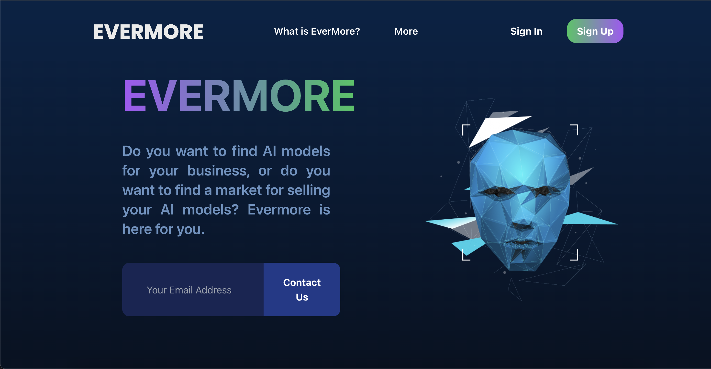
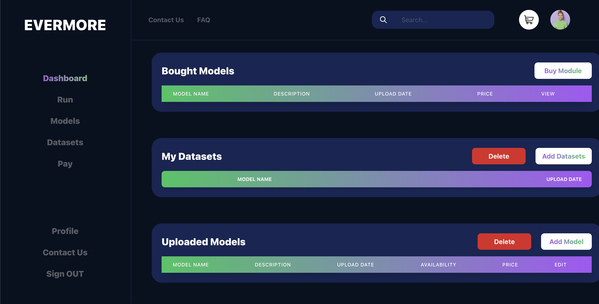
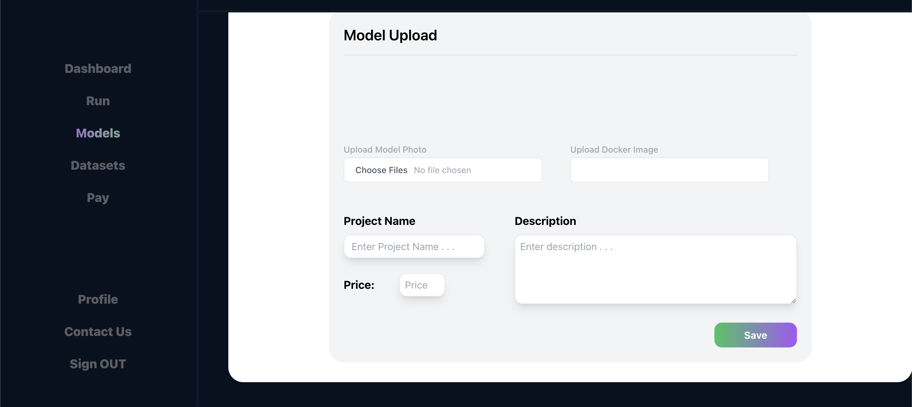
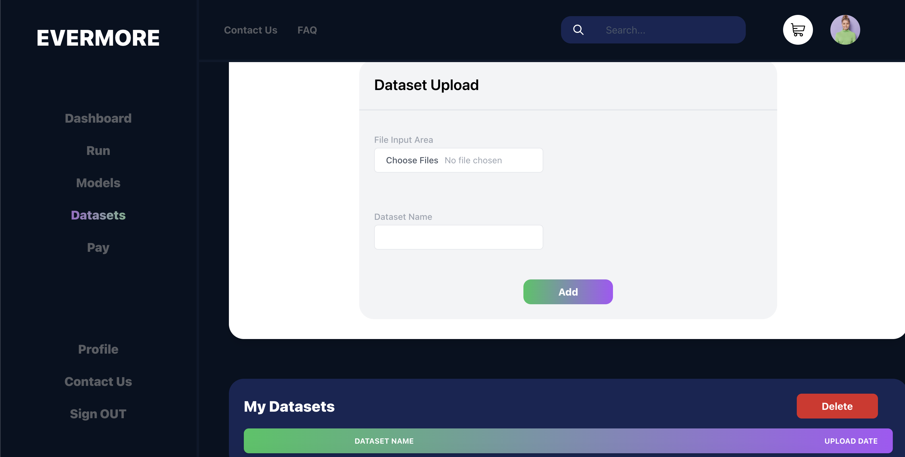
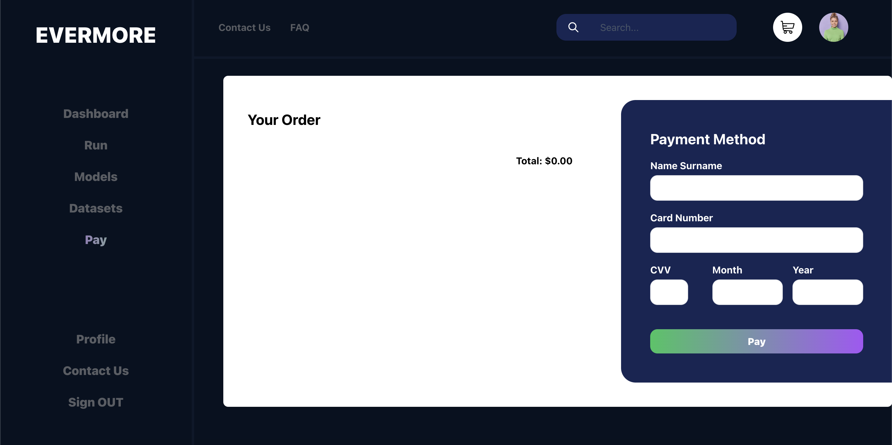
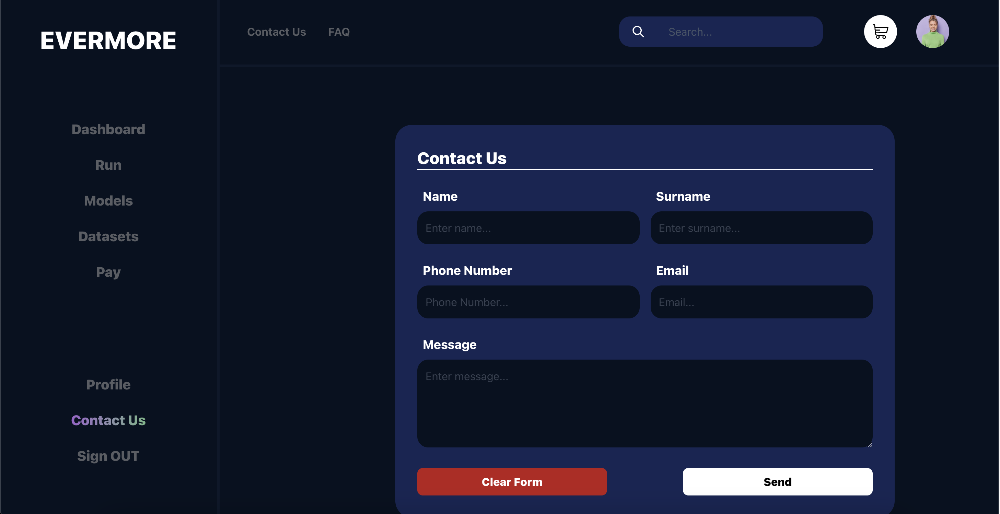

# Evermore 

Evermore is an MLaaS web application built using a microservices architecture. 
Spring Boot and Flask used for backend development. 
React framework used for frontend development. AWS is used for cloud infrastructure. 
Users upload datasets to AWS S3 and AWS RDS used for PostgreSQL instance. 
Users develop and train models using frameworks like PyTorch, TensorFlow, Scikit-Learn within Docker containers, ensuring reproducibility. Machine Learning models run in separate Docker containers, providing flexibility for model development and deployment. 
The platform supports various ML algorithms. Users can buy and sell models and datasets, promoting a collaborative and incentivized environment. 
Payment managed through Stripe for seamless transactions. 

You can see our projects presentation video here: https://studio.youtube.com/video/ybZdYfvYwg4/edit

And also you can see some of the pages: 

